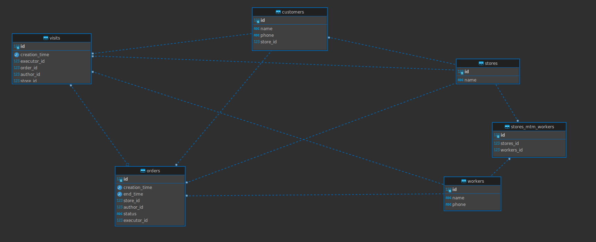

# Тестовое задание Руthon/FastAPI.

#### [Тестовое задание](https://docs.google.com/document/d/1-ds_Tv2ZBh-yYw3z8Eirq9CRXct_fuylhqRkpkrDX1U/edit)

### Для запуска приложения используйте docker-compose:

    1. docker compose build
    2. docker compose up

Переменные заданы в файле `.env.example`.

### После запуска бд будет заполнена тестовыми данными и будут доступны:
- Админка `http://0.0.0.0:8000/admin/`
- Endpoints: `http://0.0.0.0:8000/docs#/`

## Для запуска тестов: 
В локальном репозитории, после установки зависимостей `poetry install` используйте команду:

    poetry run make run tests

Для прогона тестов будет запущен контейнер PostgreSQL на порту `5632`.

### Архитектура базы данных:

